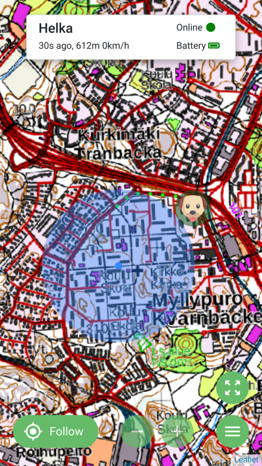

# Käyttöohje

## Karttanäkymä

Perusnäkymässä sivun yläosassa näkyy käyttäjälle lisätyt seurantalaitteet. Jos laite on aktiivinen (viimeisimmästä sijainnista alle 1h), näkyy jokaisen laitteen kohdalla etäisyys, nopeus ja aika viimeisimmästä vastaanotetusta sijainnista. Kartalla näkyy kaikkien aktiivisten laitteiden jälki. Tämä jälki näkyy vain jos viimeisimmästä sijainnista on alle tunti. Tässä jäljessä bäytetään kaikki sijainnit nykyhetkestä takaseppäin, kunnes kahden peräkkäisen sijainnin välillä on vähintään tunnin tauko. Tätä jälkeä kutsutaan sovelluksessa aktiiviseksi jäljeksi (`active track`).

Alareunassa on kartan hallintapainikkeet kuten zoomaus ja valikko. `Follow` -napista voidaan valita mihin laitteeseen kartta pidetään keskitettynä, tässä valikossa listataan vain aktiiviset laitteet. Valikkonapin yläpuolella on painike, jolla kartta voidaan keskittää siten, että kaikki aktiiviset laitteet ja käyttäjän oma sijainti näkyy kartalla, (mahdollinen vain silloin kun kartalla on aktiivisia laitteita).

### Kuva karttanäkymästä, kun laite on aktiivinen

## Valikot

Valikon juuritasolla on neljä eri toimintoa: listata tallennetut jäljet, avaa asetukset, hallitse jälkiä ja kirjaudu ulos. Uloskirjautuneena valikossa on vain kirjaudu sisään painike.

### Tallennetut jäljet

Valikkonäkymässä listataan kymmenen viimeisintä jälkeä, kuukauden mukaan ryhmiteltynä. Jäljestä esitetään laitteen nimi, päivämäärä, alku- ja loppuaika sekä pituus (ei näytä oikein). Jälkeä napauttamalla sen saa lisättyä tai poistettua kartalta.

### Asetukset

Asetuksia napauttamalla aukeaa uusi näkymä:
* Käyttäjätiedot: Ensimmäisenä avautuvassa näkymässä voi muokata käyttäjän nimeä, sekä asetusta kuinka usein backendista haetaan laitteiden viimeisimmät sijainnit. Oletuksena tämä on yksi minuutti.
* Devices: Tällä välilehdellä listataan kaikki käyttäjälle lisätyt laitteet. Laitteiden nimeä voi muokata tässä listauksessa.
* Add device: Tällä välilehdellä voi lisätä laitteen käyttäjälle, jos tietää laitteen `tracker id` arvon.

### Jälkien hallinta (manage saved tracks)

Tässä näkymässä listataan kaikki tallennetut jäljet, joihin käyttäjällä on pääsy. Listauksessa voi poistaa jälkiä kokonaan tai lisätä niitä kartalle.

